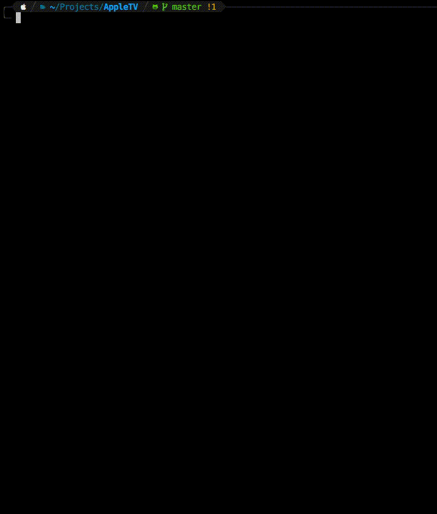

# appletv-remote-cli
Control Apple TV (latest version) using a terminal interface.

# In action

# **Important** This currently only works with node.js v11 (v11.15.0). This is due to the dependency `node-appletv`

# Install

1. Clone repository
2. Run `npm install`
3. Run `npm start`

## First run
The first run will scan your network to try and find an Apple TV to pair with. Once it's paired, the credentials for connecting are saved under `myappletv.json`. 
